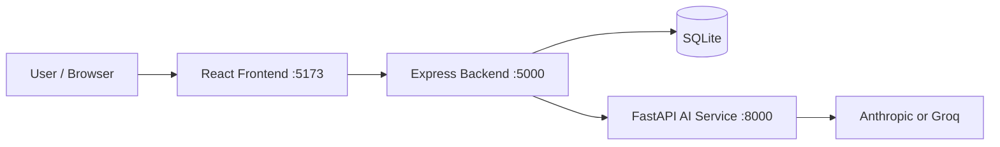

# ManoShaanti Architecture

## 1. System Context
ManoShaanti is a split-service mental wellness platform with a web frontend and two backend services.

- Frontend: React + Vite SPA for chat, wellness tools, and freemium UX.
- API layer: Node.js + Express for auth, persistence, safety checks, routing, and context building.
- AI layer: FastAPI for provider abstraction and final LLM prompt/response flow.
- Database: SQLite for user identity and wellness data.

## 2. High-Level Architecture

## 3. Frontend Architecture

### 3.1 UI Foundation
- React Router nested app shell with shared navigation and wellness styling.
- Theme context with Light/Dark mode and subtle animated transition.
- Auth context and subscription context (free, premium, student).

### 3.2 Freemium UX Layer
- Dashboard cards show Free or Premium access indicators.
- Premium lock badge and upgrade modal for gated features.
- Dedicated upgrade page with plan comparison and pricing.
- Settings page shows current plan and upgrade/manage action.

### 3.3 Voice Interaction (Chat)
Voice feature module in frontend/src/features/voice:
- stt.js: browser speech recognition wrapper.
- tts.js: browser speech synthesis wrapper.
- VoiceControls.jsx: microphone, speak button, auto-read toggle UI.

Chatbot voice capabilities:
- Speech-to-text inserts transcript into input.
- Text-to-speech reads assistant replies on demand.
- Optional auto-read of assistant responses.
- Graceful fallback for unsupported browsers and mic errors.

## 4. Backend Architecture (Node.js)

### 4.1 API Server
Entry: backend/server.js

Mounted route groups:
- /api/auth
- /api/chat
- /api/emotion
- /api/asl
- /api/journal
- /api/assessment
- /api/mood
- /api/rewards
- /api/breathing
- /api/games
- /api/activities

### 4.2 Security and Access Middleware
authMiddleware includes:
- authenticateToken
- optionalAuth
- requireUserScope
- requireAuthWhenUserIdPresent

Purpose:
- JWT auth enforcement for protected routes.
- User ownership checks for userId-scoped data.

### 4.3 Core Controllers
- authController: signup, login, me.
- chatController: crisis interception, context build, AI proxy, chat save.
- journalController: journal settings, journal password, entries, access policy.
- assessmentController: score classification and recommendation mapping.
- moodController: weekly mood aggregation.
- rewardController and game flows: points, badges, leaderboard.
- emotionController: camera emotion ingestion and logging.

### 4.4 Context Builder Module
Path: backend/services/contextBuilder.js

Responsibilities:
- fetch user context from multiple sources.
- sanitize and summarize data.
- generate structured context object and context prompt.

Context fields:
- assessment_level
- detected_emotion
- chat_summary
- journal_themes
- profile_context

Safety behavior:
- excludes raw journal text in prompt context.
- excludes sensitive personal data (phone, email, trusted contacts).

## 5. AI Service Architecture (FastAPI)

### 5.1 Route Layer
ai-service/routes/chat.py validates and accepts:
- message
- emotion
- context_object
- context_prompt
- backward-compatible optional legacy context arrays

### 5.2 AI Service Layer
ai-service/services/chatService.py:
- prefers context_prompt/context_object when provided.
- falls back to legacy prompt assembly if needed.
- routes to Anthropic or Groq provider.

## 6. Chat Request Pipeline
Current end-to-end pipeline:

User message
-> Crisis phrase check (hard override)
-> Build context from assessment, emotion, chat summary, journal themes, profile
-> Build structured prompt
-> Send to FastAPI AI service
-> LLM response
-> Save chat block (if authenticated user)
-> Return response to frontend

## 7. Data Architecture (SQLite)
Defined in backend/db/database.js.

Core tables:
- users
- auth_tokens
- journals
- journal_settings
- mood_logs
- assessments
- reward_events
- chat_history

Indexes support user and time-based access patterns for wellness features.

## 8. Safety and Ethics Layer
- Crisis phrase detection intercepts risky messages before model call.
- Essential support features remain available in free tier.
- Prompts enforce non-judgmental, supportive language and non-diagnostic behavior.

## 9. Runtime and Configuration
- Frontend dev: http://localhost:5173
- Backend API: http://localhost:5000
- AI service: http://localhost:8000
- Backend env uses AI_SERVICE_URL to reach FastAPI.

## 10. Extension Points
- Upgrade context summarization with NLP classifiers.
- Add persistent plan state sync with backend.
- Add de-identified analytics and observability.
- Replace SQLite with Postgres for scale.
